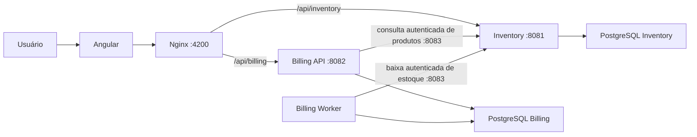
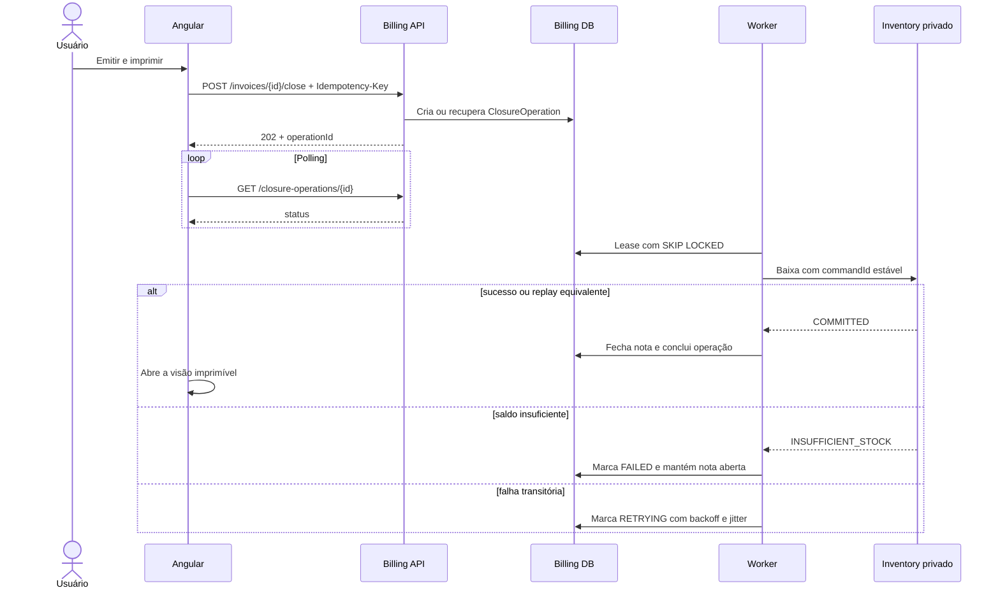

# Detalhamento técnico

Este documento descreve o estado implementado do sistema. Itens ainda não entregues são identificados explicitamente como evolução futura.

## Escopo entregue

O sistema implementa o cadastro e a consulta de produtos, criação e consulta de notas simplificadas, fechamento durável, baixa atômica de estoque e visualização imprimível. Não representa uma NF-e oficial e não integra SEFAZ, certificados, impostos ou XML fiscal.

## Componentes e versões

| Componente | Tecnologia e responsabilidade |
| --- | --- |
| Inventory Service | Go 1.26.5, chi 5, `database/sql` com pgx e PostgreSQL 18; produtos, saldos e movimentos |
| Billing API | Go 1.26.5, chi 5, `database/sql` com pgx e PostgreSQL 18; notas e operações de fechamento |
| Billing Worker | Mesmo módulo e imagem do Billing; processamento assíncrono das operações |
| Web | Angular 22, Angular Material/CDK 22, RxJS 7.8, TypeScript 6 e pnpm 11 |
| Borda web | Nginx não privilegiado; SPA, cache de arquivos estáticos, headers de segurança e proxy `/api` |
| Ambiente | Docker Compose com dois bancos, migrações one-shot, APIs, worker e web |

Cada serviço Go possui `go.mod`, `go.sum`, migrations, Dockerfile e banco próprios. O `go.work` da raiz facilita o desenvolvimento no monorepo sem criar dependência de implantação entre os serviços.

## Arquitetura

### Camadas dos serviços Go

Os dois serviços seguem `domain/application/infra`, com composição em `cmd/`:

- `domain`: entidades, invariantes, transições e contratos de repositório;
- `application`: casos de uso e portas para integrações externas;
- `infra`: HTTP, PostgreSQL, cliente remoto, configuração e observabilidade;
- `cmd`: abertura de recursos, injeção de dependências e ciclo de vida dos processos.

O fluxo permitido é `infra -> application -> domain`.

### SOLID aplicado

- Responsabilidade única: handlers traduzem HTTP, casos de uso orquestram e repositórios persistem.
- Aberto/fechado: métricas de baixa são adicionadas por decorator, sem alterar o repositório de estoque.
- Substituição: casos de uso são testados com fakes que implementam as mesmas portas da infraestrutura.
- Segregação de interfaces: handlers e casos de uso dependem de contratos pequenos, específicos para leitura, criação ou processamento.
- Inversão de dependência: application e domain não conhecem chi, PostgreSQL ou o cliente HTTP concreto.

## Domínios e persistência

### Inventory

`Product` mantém código normalizado em maiúsculas, descrição, saldo não negativo, versão e timestamps. A listagem suporta busca e filtros remotos, totalização e paginação.

`StockCommand` representa uma baixa multiproduto idempotente. O repositório:

1. inicia uma transação local;
2. registra ou recupera o comando pelo `commandId`;
3. bloqueia os produtos em ordem estável;
4. entrega os saldos bloqueados ao agregado, que valida a suficiência e planeja todas as transições;
5. grava os movimentos e novos saldos planejados;
6. persiste o resultado do comando;
7. confirma a transação.

Se qualquer item falhar, nenhum saldo é alterado. Repetir o mesmo comando e payload retorna o resultado já persistido; reutilizar o identificador com outro payload retorna conflito.

A API pública usa `:8081`. A borda privada `:8083`, disponível somente na rede do Compose, contém a baixa usada pelo Billing. A porta pública não registra rotas `/internal`.

### Billing

`Invoice` nasce `OPEN`, recebe número único e crescente de uma sequence PostgreSQL e contém de 1 a 20 itens, sempre com quantidade inteira positiva. A criação exige `Idempotency-Key`: repetir a mesma chave e o mesmo conteúdo devolve a nota já criada, enquanto reutilizá-la para outro conteúdo retorna conflito. Isso permite repetir a requisição após timeout sem duplicar a nota. As consultas necessárias ao catálogo são concorrentes e respeitam o timeout configurado para o Inventory.

Cada `InvoiceItem` guarda `productId`, código e descrição como snapshot obtido do Inventory durante a criação. Essa decisão preserva o conteúdo histórico da nota: alterações posteriores no catálogo não reescrevem o item, inclusive enquanto a nota permanece aberta. Não existe sincronização administrativa de snapshots na aplicação.

`ClosureOperation` é o job durável da emissão. Seus estados são `PENDING`, `PROCESSING`, `RETRYING`, `COMPLETED` e `FAILED`. O worker adquire operações com lease e `FOR UPDATE SKIP LOCKED`, permitindo recuperação de trabalho abandonado. Cada aquisição recebe um token de execução; somente o dono da aquisição corrente pode persistir uma transição, impedindo que um worker atrasado sobrescreva o resultado de outro.

## Fechamento, idempotência e recuperação

O `Idempotency-Key` do fechamento identifica a intenção do usuário. A operação mantém um `commandId` estável para todas as tentativas no Inventory. Assim, a entrega pode ocorrer mais de uma vez, mas a baixa efetiva ocorre uma única vez.

Falhas transitórias usam backoff exponencial com jitter. O lease permite que uma operação `PROCESSING` seja retomada após interrupção. O frontend recebe `activeClosureOperation` ao recarregar uma nota e continua o polling.

## APIs e tratamento de erros

Os contratos estão em:

- `services/inventory/api/openapi.yaml`;
- `services/billing/api/openapi.yaml`.

As falhas de negócio e validação usam Problem Details (`application/problem+json`) com `code`, `detail`, `traceId`, `retryable` e `errors`. Erros internos são enriquecidos com `%w`, registrados com contexto e convertidos para HTTP apenas na borda.

Mensagens apresentadas ao usuário são emitidas em português. O Angular também mapeia códigos estáveis e traduz mensagens legadas conhecidas, evitando exposição de detalhes técnicos em inglês.

Os middlewares implementam request ID, logs estruturados, recuperação de panic e métricas HTTP. O `commandId` é propagado para o Inventory como `X-Request-ID` e registrado com o `operationId` pelo worker.

## Frontend Angular

### Organização

A aplicação usa componentes standalone, `ChangeDetectionStrategy.OnPush`, rotas lazy e formulários reativos tipados. Cada feature separa:

- `domain`: modelos usados pela interface;
- `application`: portas, stores de listagem e facades dos fluxos de tela;
- `infrastructure`: adaptadores HTTP, DTOs e mapeadores que implementam as portas;
- `presentation`: componentes focados em renderização, eventos e navegação.

Stores e facades dependem apenas das portas da aplicação. Os adaptadores concretos são associados a essas portas em `app.config.ts`, mantendo componentes e regras de fluxo independentes de HTTP e `sessionStorage`.

Não há NgRx. Signals atendem o estado local e derivado; RxJS atende HTTP, busca, cancelamento e polling.

### Ciclos de vida utilizados

- `ngOnInit`: inicia cargas dependentes da rota nas listas, dashboard, formulário e páginas de detalhe/impressão.
- `DestroyRef` com `takeUntilDestroyed`: encerra busca, eventos de navegação e polling quando o componente é destruído.
- Hooks de verificação manual (`ngDoCheck`, `ngAfterContentChecked` e `ngAfterViewChecked`) não são usados.
- A impressão é iniciada por ação explícita com `window.print()`, portanto não exige hook de pós-renderização.

### Signals e RxJS

Signals armazenam loading, erro, filtros, página atual, entidade carregada e operação ativa. `computed` deriva totais, paginação, indicadores do dashboard e rótulos de contexto.

RxJS é usado de forma direcionada:

- `debounceTime` e `distinctUntilChanged` nas buscas;
- `switchMap` para substituir buscas e consultas anteriores;
- `exhaustMap` para impedir comandos de fechamento simultâneos;
- `timer` para polling da operação;
- `catchError` e `finalize` para erro e loading;
- `takeUntilDestroyed` para liberar streams automaticamente.

### Comportamento das telas

- Produtos e notas exibem 10 registros por página, aplicam filtros no backend e rejeitam parâmetros de paginação fora do contrato.
- O formulário da nota pesquisa produtos remotamente por código ou descrição e mostra o nome no autocomplete.
- Quantidade acima do saldo conhecido invalida o item e bloqueia a continuação; o backend revalida o saldo dentro da transação.
- Produtos repetidos são rejeitados no formulário.
- As chaves de idempotência de criação e fechamento permitem repetir comandos após falha de transporte sem duplicar efeitos.
- A chave do fechamento fica em `sessionStorage` apenas enquanto a operação está ativa e é preservada em falhas transitórias.
- A visão de impressão possui rota e CSS de mídia próprios.
- A interface usa português, semântica HTML, foco visível, link de salto e estados de loading, erro e vazio.

## Segurança e operação

- SQL parametrizado e constraints no banco;
- limite de tamanho para bodies JSON;
- timeouts nos servidores, proxy e cliente Billing -> Inventory;
- imagens multi-stage e processos não-root;
- CSP, proteção contra framing, `nosniff`, Referrer Policy e Permissions Policy no Nginx;
- redes separadas para borda, comunicação interna e cada banco;
- endpoints internos não publicados no host e protegidos por token no header `X-Internal-Token`;
- configuração por variáveis de ambiente e `.env.example` sem segredos reais;
- graceful shutdown das APIs e do worker;
- `/health`, `/ready` e `/metrics` nos serviços.

As métricas Prometheus incluem volume e duração HTTP com labels controlados, resultados de baixa no Inventory e estados, tentativas e idade da operação acionável mais antiga no Billing.

## Testes e pipeline

O pipeline em `.github/workflows/ci.yml` executa:

- `go mod tidy`, formatação, `go vet`, `go test -race`, auditoria e build para cada serviço;
- testes de repositório contra PostgreSQL real após a aplicação das migrations;
- instalação reproduzível, lint, testes, auditoria de produção e build Angular;
- build do Compose, readiness e os cenários `scripts/e2e-smoke.mjs` e `scripts/failure-recovery.mjs`.

Os cenários de integração cobrem fluxo feliz, snapshot, replay idempotente, atomicidade multiproduto, concorrência com saldo 1 e recuperação após indisponibilidade do Inventory.
